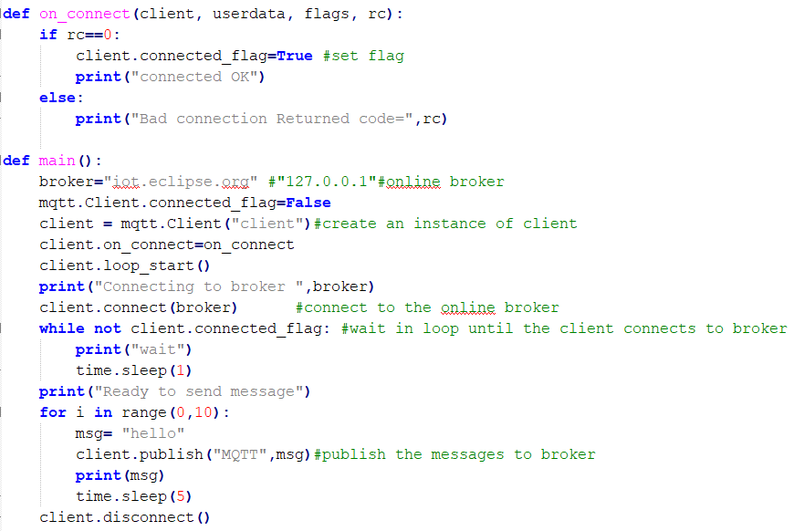

# MQTT

**Install MQTT**

``sudo pip install paho-mqtt``

Is a lightweight publish/ subscribe messaging protocol. It can be used
in IoT scenarios where the sensor data is communicated through a broker
to a server which can be a database. In the previous ZMQ examples we
have seen the actors communicating messages amongst themselves, there
were no brokers involved. However, through the second assignment we have
also created a broker between the two actors. The broker we had was very
simple, it was acting as a pipeline to pass the messages. However in
distributed applications, broker plays a very important role in
scheduling messages, load balancing, etc. MQTT allows the luxury to have
broker services online or on local host.

**Server.py**

In this example the server subscribes to a specific topic and the
message is received from the MQTT broker. The broker receives the
message from the client and stores it, the data then can be subscribed
by a single/ multiple servers.

**Broker** is the MQTT broker service. This service can either be
online/ on the local host. There is a list of online available brokers
which can be used if you do not want to have a local machine to run the
broker.

**Topic** is message for which the server wants to listen for. The
server can subscribe to a single/ multiple topics.

**Client = mqtt.Client(“Server”)** creates a server instance of MQTT
type.

**Client.on\_message** is used to call a function every time a message
is received. In the above example, the message received will be printed
on the terminal. This function can be anything.

**Client.connect(broker)** connects to the broker.

**Client.subscribe(“Topic”)** subscribes to the messages under the topic
defined.

**Client.py**

The client connects to the MQTT broker and publishes data which can then
be subscribed at a later time by the server.

Everything remains the same as the server script, but here instead of
subscribing, the client publishes the data under a topic. In this case
the topic is “MQTT”.

Client.on\_connect() once again calls a function to check for the
connection between client and the broker. So, if the connection succeeds
then the control enters into the main loop or else waits for the
connection to succeed.

**References**

-   <http://mqtt.org/>

-   <https://www.eclipse.org/paho/clients/python/docs/>

